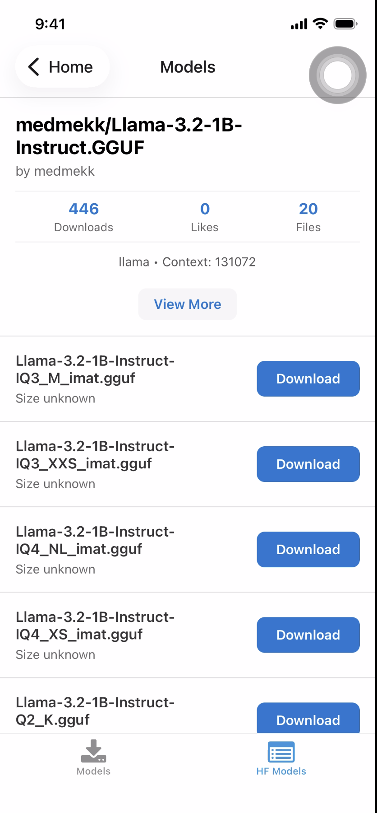
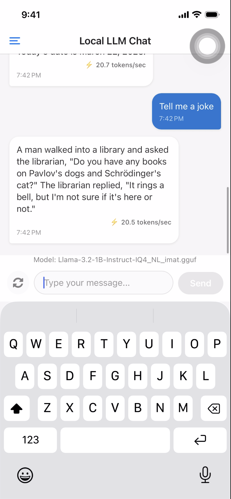

# Expo Local LLM Mobile

A React Native mobile application that runs Large Language Models (LLMs) locally on your device using llama.rn. Browse and download AI models from HuggingFace, then chat with them entirely offline.

## About

This app allows you to:
- Browse and download Llama models from HuggingFace
- Run AI models directly on your mobile device
- Chat with AI models without internet connection
- View real-time inference performance (tokens per second)

Tested on iOS device.

## Demo

### Screenshots

Models Screen | Chat Screen
:---:|:---:
 | 

### Video Demo

[Watch Demo Video](example/demo_video.mp4)

## Prerequisites

- Node.js installed
- iOS development environment (Xcode, CocoaPods)
- macOS (for iOS development)

## Setup

1. Clone the repository

```bash
git clone <repository-url>
cd expo-local-llm-mobile
```

2. Install dependencies

```bash
npm install
```

3. Install iOS pods

```bash
cd ios
pod install
cd ..
```

4. Build and run on iOS device

```bash
npm run ios
```

Note: For first-time setup, you may need to run:

```bash
npx expo run:ios
```

## Usage

1. Open the app on your iOS device
2. Navigate to the Models section
3. Browse available Llama models from HuggingFace
4. Download a model (note: models can be several GB in size)
5. Return to the chat screen
6. Start chatting with your local AI model

## Key Technologies

- React Native with Expo
- llama.rn for on-device LLM inference
- Expo Router for navigation
- SQLite for local storage
- Zustand for state management
